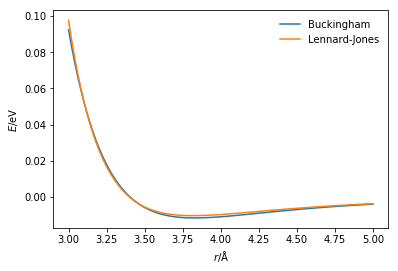

---
redirect_from:
  - "/classical-methods/van-der-waals"
interact_link: content/classical_methods/van_der_waals.ipynb
title: 'The van der Waals interaction'
prev_page:
  url: /classical_methods/potential_models
  title: 'Potential models'
next_page:
  url: 
  title: ''
comment: "***PROGRAMMATICALLY GENERATED, DO NOT EDIT. SEE ORIGINAL FILES IN /content***"
---

### The van der Waals interaction

The potential model for the short-range interaction between atoms is less well defined.
It is often referred to as the **van der Waals** interaction, and encompasses both the attractive London dispersion effects and the repulsive Pauli exclusion principle. 
There are a variety of ways that the van der Waals interaction can be modelled. 

One commonly applied method is the **Lennard-Jones** potential model , which considers the attractve London dispersion effects as follows, 

$$ E_{\text{attractive}}(r_{ij}) = \dfrac{-B}{r_{ij}^6},$$ 

where $B$ is some constant for the interaction, and $r_{ij}$ is the distance between the two atoms. 
The Pauli exclusion principle is repulsive and only present over very short distances, and is therefore modelled with the relation, 

$$ E_{\text{repulsive}}(r_{ij}) = \dfrac{A}{r_{ij}^{12}},$$

where $A$ is some interaction specific constant.
The Python code below defines each of the components of the Lennard-Jones potential, and the total energy of the interaction.
These are then all plotted on a single graph. 
The values of $A$ and $B$ are those associated with an argon-argon interaction, as defined by Rahman .


{:.input_area}
```python
%matplotlib inline
import numpy as np
import matplotlib.pyplot as plt

def attractive_energy(rij, b):
    """
    Attractive component of the Lennard-Jones interaction
    energy.
    
    Parameters
    ----------
    rij: float
        Distance between particles i and j
    b: float 
        B parameter for interaction between i and j
    
    Returns
    -------
    float
        Energy of attractive component of Lennard-Jones 
        interaction
    """
    return -b / np.power(rij, 6)

def repulsive_energy(rij, a):
    """
    Repulsive component of the Lennard-Jones interaction
    energy.
    
    Parameters
    ----------
    rij: float
        Distance between particles i and j
    a: float 
        A parameter for interaction between i and j
    
    Returns
    -------
    float
        Energy of repulsive component of Lennard-Jones 
        interaction
    """
    return a / np.power(rij, 12)

def lj_energy(rij, a, b):
    """
    Implementation of the Lennard-Jones potential 
    to calculate the energy of the interaction.
    
    Parameters
    ----------
    rij: float
        Distance between particles i and j
    a: float 
        A parameter for interaction between i and j
    b: float 
        B parameter for interaction between i and j
    
    Returns
    -------
    float
        Energy of the interaction between i and j.
    """
    return repulsive_energy(rij, a) + attractive_energy(rij, b)

r = np.linspace(3e-10, 8e-10, 100)
fig = plt.figure(figsize=(8, 5))
ax = fig.add_subplot(111)
ax.plot(r, attractive_energy(r, 9.273e-78), label='Attractive')
ax.plot(r, repulsive_energy(r, 1.363e-134), label='Repulsive')
ax.plot(r, lj_energy(r, 1.363e-134, 9.273e-78), label='Lennard-Jones')
ax.set_xlabel(r'$r_{ij}$/m')
ax.set_ylabel(r'$E$/J')
ax.legend(frameon=False)
plt.show()
```


{:.output .output_png}


The Lennard-Jones potential is not the only way to model the van der Waals interaction. 
Another commonly applied potential model is the **Buckingham** potential.
Similar to the Lennard-Jones potential, the Buckingham models the attractive term with a power-6. 
However, instead of the power-12 repulsion, this is modelled with an exponential function. 
The total Buckingham potential has the following form, 

$$ E_{\text{Buckingham}}(r_{ij}) = A\exp{-Br_{ij}} - \dfrac{C}{r_{ij}^6}, $$

where $A$, $B$, and $C$ are interaction specific parameters that must be determined. 
N.B. these are not the same $A$ and $B$ as in the Lennard-Jones potential. 

The Python code below allows the comparison between these two van der Waals potentials, using defined parameters for the argon-argon interaction .


{:.input_area}
```python
def buckingham_energy(rij, a, b, c):
    """
    Implementation of the Buckingham potential 
    to calculate the energy of the interaction.
    
    Parameters
    ----------
    rij: float
        Distance between particles i and j
    a: float 
        A parameter for interaction between i and j
    b: float 
        B parameter for interaction between i and j
    c: float 
        C parameter for interaction between i and j
    
    Returns
    -------
    float
        Energy of the interaction between i and j.
    """
    return a * np.exp(-b * rij) - c / np.power(rij, 6)

r = np.linspace(3e-10, 8e-10, 100)
fig = plt.figure(figsize=(8, 5))
ax = fig.add_subplot(111)
ax.plot(r, buckingham_energy(r, 1.69e-15, 3.66e10, 1.02e-77), label='Buckingham')
ax.plot(r, lj_energy(r, 1.363e-134, 9.273e-78), label='Lennard-Jones')
ax.set_xlabel(r'$r_{ij}$/m')
ax.set_ylabel(r'$E$/J')
ax.legend(frameon=False)
plt.show()
```


{:.output .output_png}



There is a small but clear difference between the two potential energy functions, this may be due to the different potential model or due to the [parameterisation](02_episode.ipynb) of that model.

## Important!

These are just two of many potentials for modelling of the van der Waals interation. Furthermore, the parameters used in the model are just one example of the many possible parameterisations of the argon-argon interaction. 


## References


